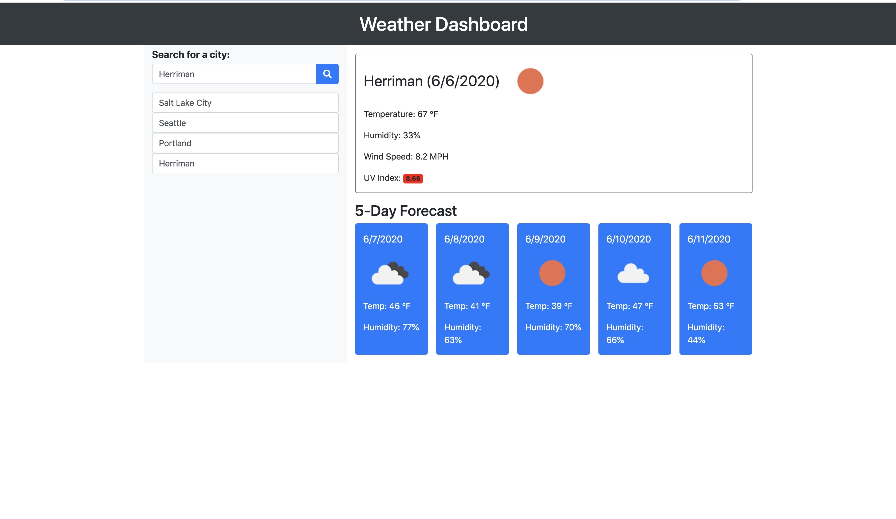

# Weather Dashboard
>A program that allows users to check the weather by city.

## Table of contents
* [General info](#general-info)
* [Functionality](#functionality)
* [Screen Shots](#screenshots)
* [Status](#status)
* [Link](#link)
* [Contact](#contact)

## General info
This app will allow you to search for a city and will then show you the current tempurature, humidity, wind speed, and UV Index, along with an icon showing the current weather. It will also show you the 5 day forecast for that city.

## Functionality
After searching for a city, that city will be stored in localStorage and show on the list below the search bar, allowing you to click on it again for quick reference.
The background color for UV Index will change between green, yellow, orange, or red based on the index number.
Used Axios to pull data from the OpenWeatherMap API to collect weather.data.

## Screenshots

## Status
Project is: _complete_ (for now)

## Links
Live Page Link - https://johnnielsen1221.github.io/weather-dashboard/
Respository Link - https://github.com/JohnNielsen1221/weather-dashboard

## Contact
Created by John Hayes Nielsen - johnhayesnielsen@gmail.com
